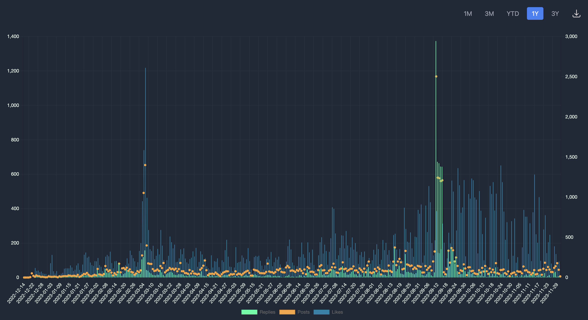

# Bar Chart With Data Selector




In this tutorial, we'll go through the process of adding a date selector to a widget that fetches data from an API and displays it in a chart. The date selector allows users to filter the data based on predefined date ranges. Let's break down the example code into steps for better understanding.

## Step 1: Fetching Data

First, you're fetching data from an API using the `fetch` method. The API returns the latest data, which will be processed later.

```javascript
let raw_data = fetch(
  "https://api.flipsidecrypto.com/api/v2/queries/f22d1d23-8993-45ea-9cbb-d27eba5b106d/data/latest",
  {
    subscribe: true,
    method: "GET",
    headers: {
      Accept: "*/*",
    },
  }
);
```

## Step 2: Initializing State

You're initializing the state with a default date range selection and an empty array for raw data.

```javascript
const initialState = {
  selectedDateRange: "1Y",
  rawData: [],
};

state = State.init(initialState);
```

## Step 3: Date Range Selection

The `handleDateRangeChange` function updates the state with the selected date range. This function will be triggered when a user selects a different date range.

```javascript
const handleDateRangeChange = (range) => {
  State.update({
    selectedDateRange: range,
  });
};
```

## Step 4: Processing Data

The `processData` function filters and sorts the raw data based on the selected date range. It adjusts the start date according to the range and filters the data accordingly.

```javascript


const data = raw_data.body || [];
State.update({ rawData: data });

// Logic to set startDate based on dateRange
// Filter and sort rawData based on date range

const processData = (rawData, dateRange) => {
  const endDate = new Date();
  let startDate = new Date();

  switch (dateRange) {
    case "1M":
      startDate.setMonth(endDate.getMonth() - 1);
      break;
    case "3M":
      startDate.setMonth(endDate.getMonth() - 3);
      break;
    case "YTD":
      startDate = new Date(endDate.getFullYear(), 0, 1); // start of the year
      break;
    case "1Y":
      startDate.setFullYear(endDate.getFullYear() - 1);
      break;
    case "3Y":
      startDate.setFullYear(endDate.getFullYear() - 3);
      break;
  }

  const processedData = rawData.filter((entry) => {
    const entryDate = new Date(entry["DATE"]);
    return entryDate >= startDate && entryDate <= endDate;
  });

  // Sort the processed data by date
  return processedData.sort(
    (a, b) => new Date(a["DATE"]) - new Date(b["DATE"])
  );
};


```

## Step 5: Preparing Chart Data

You're mapping the processed data to prepare the datasets for the chart. Each dataset represents a different metric (e.g., POSTS\_COUNT, LIKES\_COUNT, REPLIES\_COUNT).

```javascript

const dataToDisplay = processData(state.rawData, state.selectedDateRange);

const dates = dataToDisplay.map((entry) => entry["DATE"]);

const POSTS_COUNT = {};
const LIKES_COUNT = {};
const REPLIES_COUNT = {};

dataToDisplay.forEach((entry) => {
  POSTS_COUNT[entry["DATE"]] = entry["POSTS_COUNT"];
  LIKES_COUNT[entry["DATE"]] = entry["LIKES_COUNT"];
  REPLIES_COUNT[entry["DATE"]] = entry["REPLIES_COUNT"];
});
```

## Step 6: Chart Configuration

Define the options for the chart, such as aspect ratio, interaction mode, legend display, and axis configuration.

```javascript

const stacked_options = {
  maintainAspectRatio: true,
  interaction: {
    mode: "index",
    intersect: false,
  },
  stacked: false,
  plugins: {
    legend: {
      display: true,
      position: "bottom",
    },
  },
  scales: {
    y: {
      type: "linear",
      display: true,
      position: "left",
      grid: {
        color: "rgb(41,51,64)", // This will change the gridline color
      },
      ticks: {
        color: "rgb(240,255,240)", // This will change the axis text label color
      },
    },
    y1: {
      type: "linear",
      display: true,
      position: "right",

      ticks: {
        color: "rgb(240,255,240)", // This will change the axis text label color
      },
      grid: {
        drawOnChartArea: false,
        color: "rgb(41,51,64)", // This will change the gridline color
      },
    },
    y2: {
      type: "linear",
      display: false,
      position: "right",

      ticks: {
        color: "rgb(240,255,240)", // This will change the axis text label color
      },
      grid: {
        drawOnChartArea: false,
        color: "rgb(41,51,64)", // This will change the gridline color
      },
    },
    x: {
      grid: {
        color: "rgb(41,51,64)", // This will change the gridline color
      },
      ticks: {
        color: "rgb(240,255,240)", // This will change the axis text label color
      },
    },
  },
};

const stacked_bar_data = {
  dates,
  datasets: [
    {
      label: "Replies",
      type: "bar",
      data: REPLIES_COUNT,
      backgroundColor: "rgb(0,255,159)",
      yAxisID: "y2",
    },
    {
      label: "Posts",
      type: "line",
      data: POSTS_COUNT,
      backgroundColor: "rgb(250,164,58)",
      yAxisID: "y1",
    },
    {
      label: "Likes",
      type: "bar",
      data: LIKES_COUNT,
      backgroundColor: "rgb(13,131,171)",
      yAxisID: "y",
    },
  ],
};
```

## Step 7: Rendering the Widget

Finally, render the widget with the date selector buttons and the chart. The date selector buttons allow the user to change the date range, which updates the displayed data in the chart.

```javascript
return (
  <Style>
    <div className="relative text-bg-dark rounded-4 p-3 mb-4">
      <div className="absolute top-0 right-0 flex space-x-2 p-3">
        {["1M", "3M", "YTD", "1Y", "3Y"].map((range) => (
          <button
            key={range}
            onClick={() => handleDateRangeChange(range)}
            className={`px-3 py-1 rounded transition-colors duration-200 ease-in ${
              state.selectedDateRange === range
                ? "bg-blue-500 text-white"
                : "bg-gray-800 text-gray-400 hover:bg-gray-700"
            }`}
          >
            {range}
          </button>
        ))}

        <button className="px-3 py-1 rounded transition-colors duration-200 ease-in bg-gray-800 text-gray-400 hover:bg-gray-700">
          <a
            href="https://api.flipsidecrypto.com/api/v2/queries/f22d1d23-8993-45ea-9cbb-d27eba5b106d/data/latest"
            target="_blank"
            rel="noopener noreferrer"
            className="text-red-50 whitespace-normal break-words block max-w-xs"
          >
            <svg
              xmlns="http://www.w3.org/2000/svg"
              fill="none"
              viewBox="0 0 24 24"
              strokeWidth={1.5}
              stroke="currentColor"
              className="w-6 h-6"
            >
              <path
                strokeLinecap="round"
                strokeLinejoin="round"
                d="M3 16.5v2.25A2.25 2.25 0 005.25 21h13.5A2.25 2.25 0 0021 18.75V16.5M16.5 12L12 16.5m0 0L7.5 12m4.5 4.5V3"
              />
            </svg>
          </a>
        </button>
      </div>
      <div className="rounded-4 p-3 mb-4 pt-16">
        {" "}
        {data !== null ? (
          <div>
            <BarEl options={stacked_options} data={stacked_bar_data} />
          </div>
        ) : (
          <div>Loading ...</div>
        )}
      </div>
    </div>
  </Style>
);
```

## Key Points to Remember

* The date selector enhances user interactivity, allowing users to view data relevant to specific time frames.
* Ensure that the data processing correctly handles the date ranges and updates the chart accordingly.
* Styling and layout play an important role in making the widget user-friendly and visually appealing.

This widget, with the added functionality of a date selector, offers a dynamic way to visualize data over different time periods, which is particularly useful in analytics and reporting dashboards.


